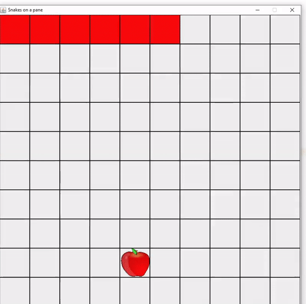

# Snake-ML
An evolution inspired snake that learns to complete the game

Inputs to the snake agent are the relative proximity to walls on all three sides from the snake's head (the front square of the snake's body), as well as the relative position of the apple in the forwards and sideways axis from the snake head's point of view.

The agent uses a standard fully-connected 3 layer perceptron to take the 5-dimensional input vector and make a prediction to either turn left, right, or continue straight.

100000 agents are simulated each epoch, with the best "surviving". Their internal neural networks are randomly combined with other successful agents, with some randomness added to the model as well, to produce "offspring" for the next generation. After around 30 generations of improvements, the best agents start to be quite capable as shown below:

